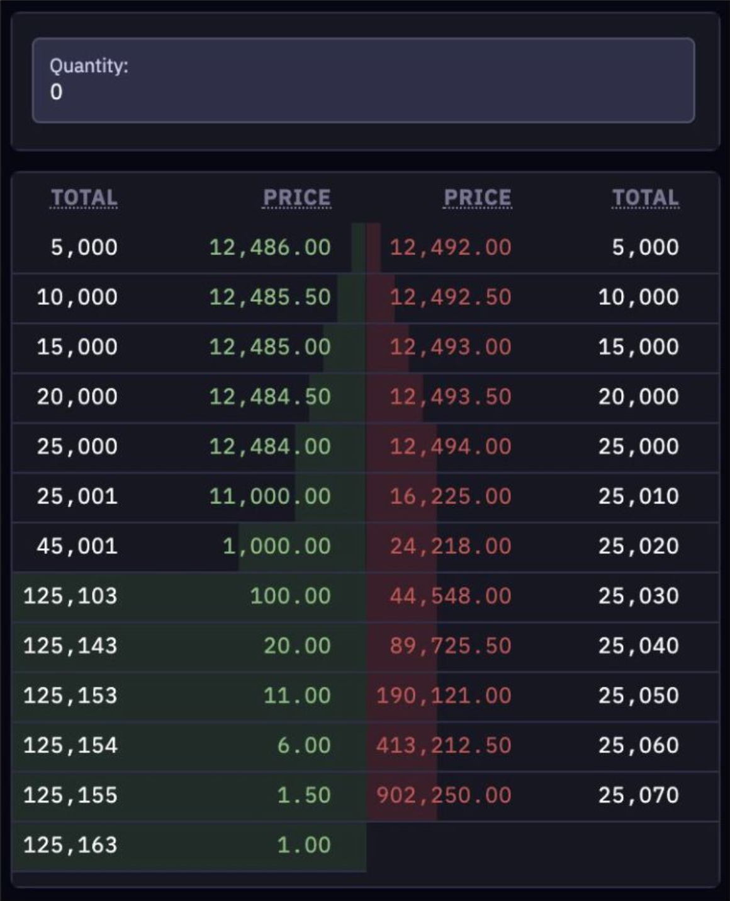
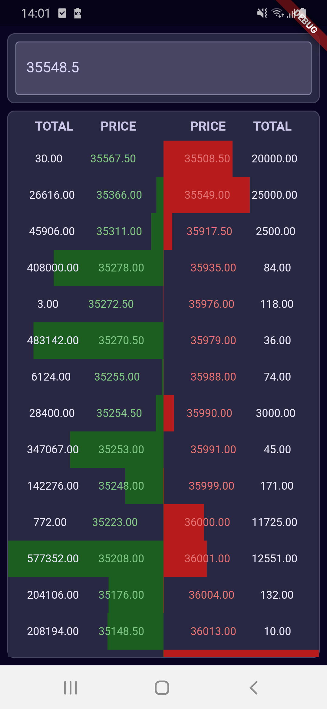

# Kraken - CryptoWatch assessment

# TLDR; How to run
Assuming you have Flutter installed on your env.

2 choices:
* Via your preferred IDE, example for example Android Studio:
  * Open the `app` folder in the IDE.
  * create a Flutter run configuration with `lib/presentation/main.dart` entrypoint.
  * Click on run.
* Via CLI:
  * cd to `app`
  * run `flutter pub get`
  * run `flutter packages pub run build_runner build --delete-conflicting-outputs`
  * run `flutter run lib/presentation/main.dart`

# The context
This project is an assessment asked by Kraken (CryptWatch) during the interview process of a Flutter developer position.

As stated:
    
    We would like you to create an application that contains a single route displaying an orderbook and an input field.

    The orders that the orderbook will be composed of can be retrieved from `wss://futures.kraken.com/ws/v1` using the following message to connect to the websocket:

    {"event":"subscribe","feed":"book","product_ids":["PI_XBTUSD"]}

    The input should be blank by default, and clicking on a row inside the orderbook should populate the value of the input to be that price. Here is a rough mock for design inspiration that does not need to be followed:

    The application must be built using Flutter. Any state management and API layer libraries you wish to include can be a personal choice. Although this is a very small application, it should be optimized for performance where possible, written to be scalable in the future.

    Please provide any documentation required for us to run this code locally.

# The project
## Analysis
By exploring the websocket endpoint, we can see there are different data going through (with different formats).

Comparing it with the above statement, here is what I assumed:
* We connect to the WS endpoint for one ticker and it answered with an `event`.
* We subscribe to the WS endpoint with a ticker and it answers with an `event`.
* The returned book entries are done in 2 formats:
  * The first one is a snapshot with 2 book entries lists `asks` and `bids`.
  * Single book entry as long as we are connected with side `buy` (bids) and `sell` (asks).

## Choices
### Architecture
I have chosen the Clean Architecture (more in [Uncle Bob definition](https://blog.cleancoder.com/uncle-bob/2012/08/13/the-clean-architecture.html)), layering the application in 3 different layers (data, domain, and presentation).

Some benefits of doing so includes: Framework independence, UI independence, Separation of concern, Highly testable.

### Technologies
I notably used the following lib and design pattern:
* MVVM for the presentation layer with BloC.
* GetIt for dependencies injection.
* Stream for all flows, backed by RxDart.
* Freezed for Sealed Class and serialization.
* Mockito for unit testing.
* Logger.

## Result
Here is a screen showing the app:

## Limitations
Due to the nature of the project (assessment) and the time invested, here are some points that need improvements I am aware of.

### Errors
At the current state, there is no error handling, all Stream can be subject to exceptions.

### Code coverage
I included some unit tests to show how I do it, but it's obviously far from complete.

### UI
All views are built in one file, this can be separated and be built with custom views.

We could debounce the incoming books, to avoid flooding the UI too much.

There is no theme.
